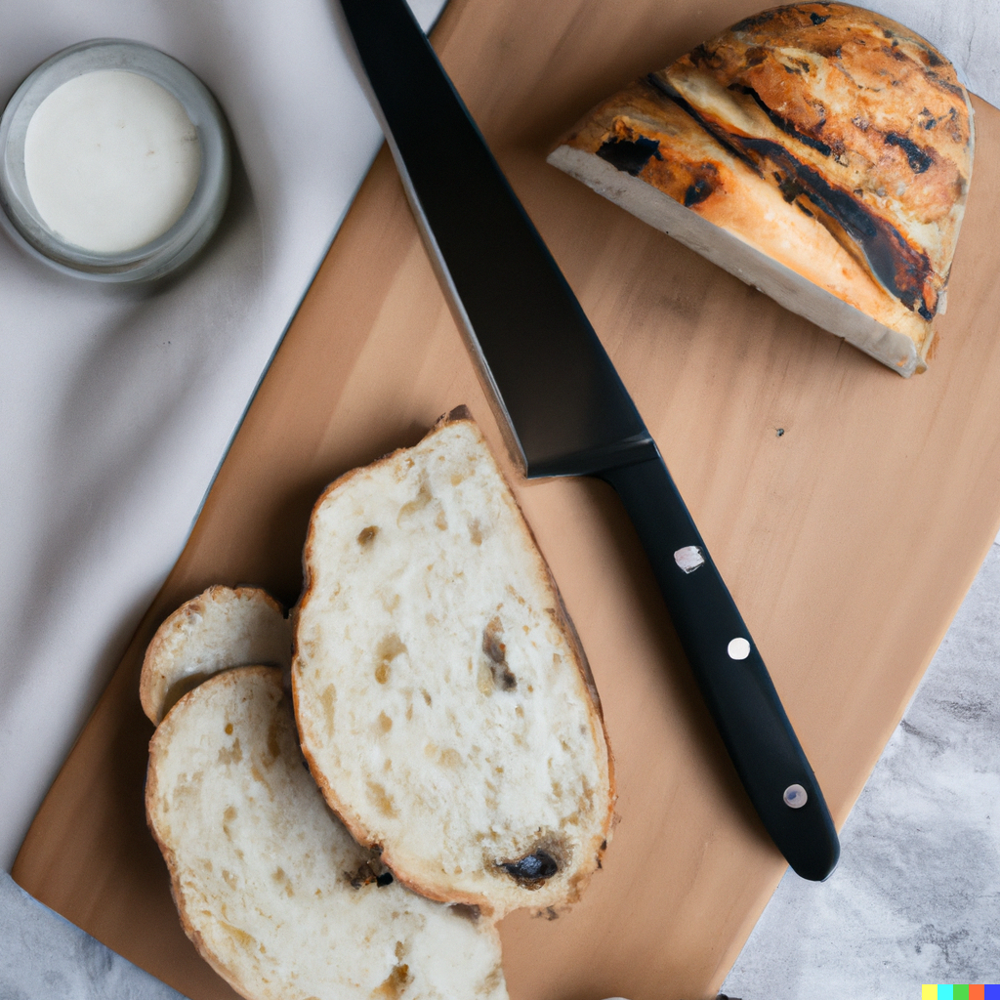

# Sourdough Bread with Whole Grains

## Synonyms

- Whole Grain Sourdough Bread
- Artisan Sourdough Bread
- Healthy Sourdough Loaf

## Ingredients

- Fresh sourdough starter (Madre)
- 520g flour (120g whole grain, 400g bread flour)
- 400g water
- 10g coarse salt
- Additional water for bassinage
- Additional oil for forming

## Instructions

1. Mix the fresh sourdough starter, flour, salt, and ascorbic acid. Begin the process of fermentolyzis (letting the dough rest to allow the enzymes to break down the starches and proteins).
2. Perform the first bassinage: Add part of the water and salt to the dough, mixing until incorporated.
3. Add a small amount of oil to the dough, followed by more water, continuing this alternating process until all the oil and water have been incorporated. Aim for a soft yet tough consistency.
4. Perform a windowpane test to ensure sufficient gluten development. The dough should be elastic and translucent when stretched.
5. Apply the stretch and fold technique every 30 minutes for the first 2 hours of the initial rise. This involves gently lifting and folding the edge of the dough over to the center, turning the bowl 90 degrees, and repeating until all sides have been stretched and folded.
6. After the final stretch and fold, let the dough rest and rise until it has approximately doubled in size.
7. Preheat the oven with 250ml water and an oven stone (if available) to 265°C.
8. Shape the dough into a loaf, making sure it maintains a jiggly consistency. Wet the surface of the dough with a little water.
9. Score the dough (cut a shallow slit on its surface) and create a pattern of your choice (e.g., a grain pattern) if desired.
10. Bake for 10 minutes at 265°C.
11. Reduce the oven temperature to 195°C and bake for an additional 42 minutes.
12. Remove the bread from the oven and let it cool on a wire rack.

## Notes

- The process of bassinage (adding water in stages) helps to achieve a dough with a more open crumb and a pleasing texture.
- Be careful not to add too much water during bassinage. The dough should be soft but still tough.
- The stretch and fold technique helps strengthen the dough's structure, promoting a better rise and more open crumb.
- The windowpane test is a good way to check if your dough has been kneaded enough. A small piece of dough should be able to stretch thin enough to let light pass through without tearing.

## Source

- To be added

## See Also

- [Whole Wheat Sourdough Bread](./WholeWheatSourdough.md)
- [Artisan Sourdough Bread](./ArtisanSourdough.md)
