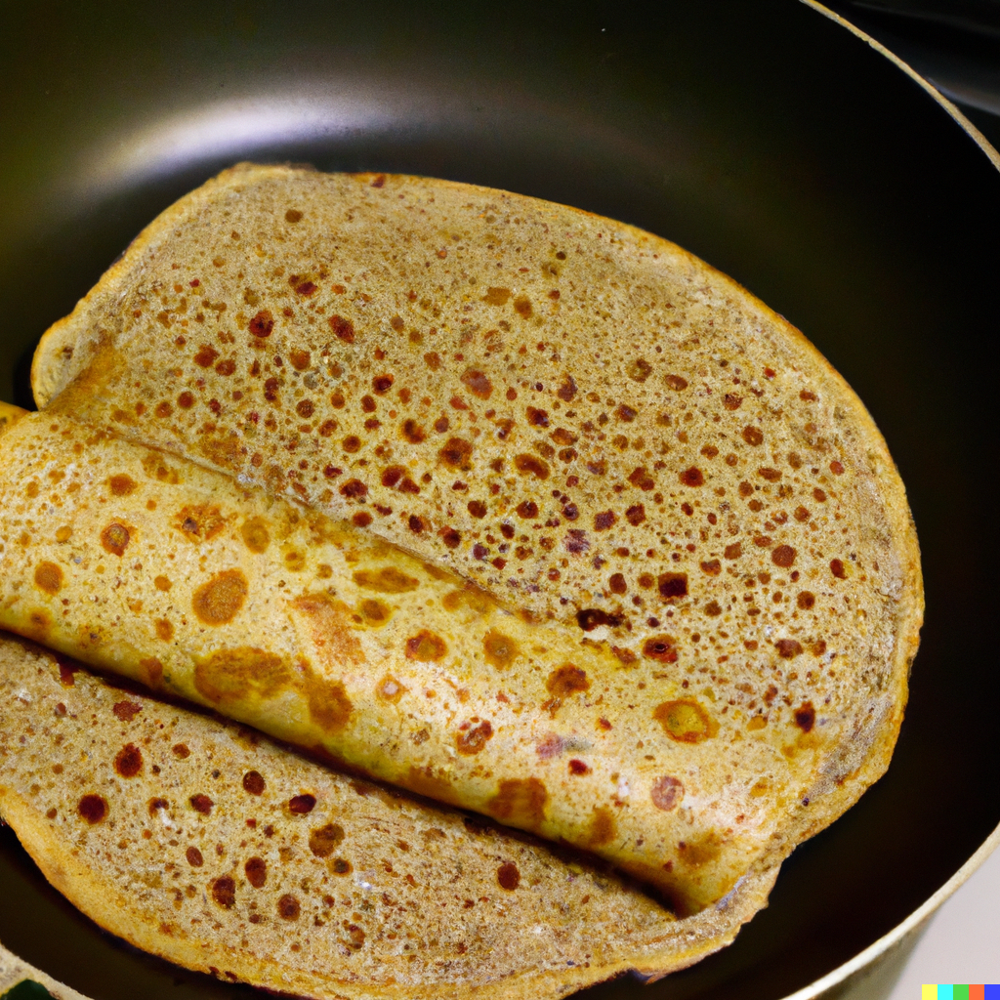

# Rolled Oat Crepes

## Synonyms

- Oat Flour Crepes
- Healthy Crepes
- Whole Egg Oat Pancakes

## Ingredients

- 600ml water
- 350g rolled oat flour (or regular flour)
- 3 whole eggs
- 50ml oil
- Additional oil for baking

## Instructions

1. In a mixing bowl, combine half of the water, rolled oat flour, eggs, and 50ml of oil.
2. Begin mixing the ingredients, slowly adding in the remaining water.
3. Continue mixing until you achieve a texture similar to heavy cream. If needed, add a bit more water to attain the desired consistency.
4. Lightly oil a crepe pan or a non-stick skillet.
5. Pour a portion of the batter onto the pan, swirling it to spread evenly.
6. Cook until the underside is lightly browned, then flip and cook the other side.
7. Repeat with the remaining batter, ensuring to lightly oil the pan between each crepe.

## Notes

- The rolled oat flour can be substituted with regular flour if preferred.
- The batter's consistency is essential; aim for a texture similar to heavy cream to ensure soft, pliable crepes.

## Source

- To be added

## See Also

- [Fluffy Pancakes](./FluffyPancakes.md)
- [Chocolate Crepes](./ChocolateCrepes.md)
