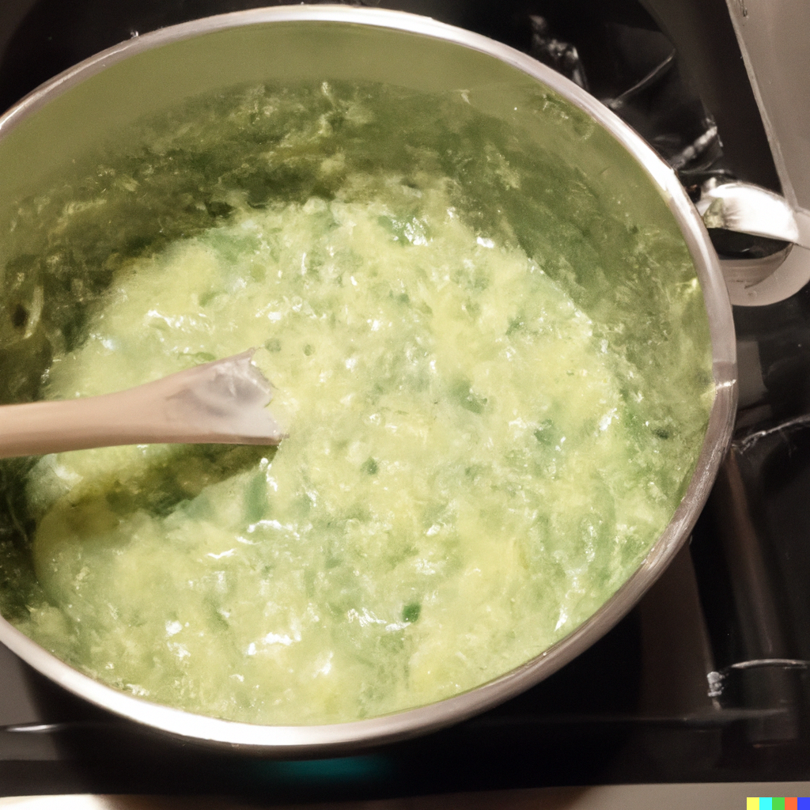

# Creamy Dill & Garlic Yellow Squash

## Synonyms

- Garlic Dill Squash Delight
- Creamy Yellow Squash Medley
- Dill & Garlic Squash Gravy

## Ingredients

- 2 cloves of garlic, minced
- 2 tablespoons of oil
- 2 tablespoons of flour
- Water (amount as needed)
- 2 medium yellow squashes, mandolined
- 1-2 teaspoons of salt
- Fresh or dried dill to taste

## Instructions

1. In a skillet, brown the garlic in 2 tablespoons of oil.
2. Add 2 tablespoons of flour to the garlic and brown together.
3. Gradually add some water, whisking to create a smooth gravy.
4. Add in the mandolined yellow squashes to the mixture.
5. Season with 1-2 teaspoons of salt and add dill.
6. Cook until squashes are tender and flavors meld together.

## Notes

- Adjust the consistency by adding more or less water, based on your preference.
- Fresh dill can be substituted with dried dill, but adjust quantity based on potency.

## Source

- To be added

## See Also

- [Zucchini Garlic Sauté](./ZucchiniGarlicSaute.md)
- [Creamy Vegetable Medley](./CreamyVegetableMedley.md)
